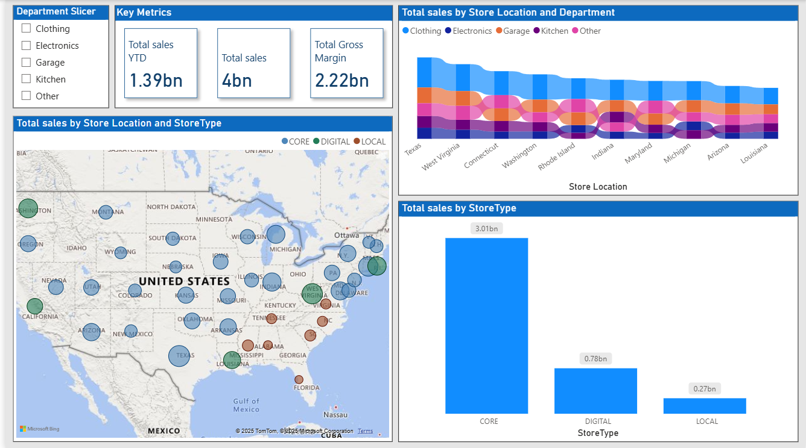
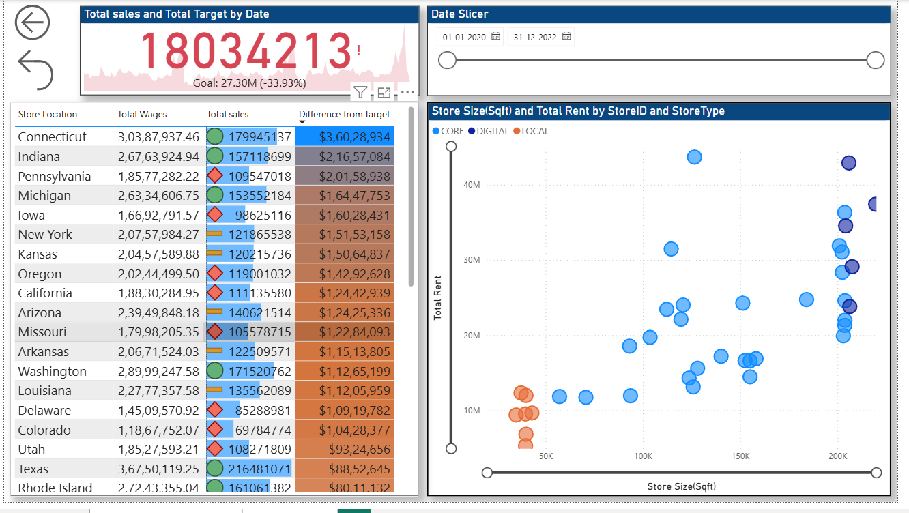

# 🛍️ Retail Sales Analysis Dashboard (Power BI)

## 📌 Project Overview
This repository contains a **Retail Sales Analysis Dashboard** built in **Power BI**.  
It provides insights into **sales performance, store operations, and profitability** across multiple US states.  
The dashboard helps decision-makers track **key metrics**, compare store performance, and analyze profitability trends.

---

## 📊 Dashboard Features

### 1. **Key Metrics**
- **Total Sales YTD**: `1.39bn`
- **Total Sales**: `4bn`
- **Total Gross Margin**: `2.22bn`

### 2. **Sales Analysis**
- **Total Sales by Store Location & Department**  
  Compare Clothing, Electronics, Garage, Kitchen, and Other categories across store locations.
- **Sales by Store Type**  
  Breakdown into **Core (3.01bn), Digital (0.78bn), and Local (0.27bn)**.
- **Geographical Sales View**  
  Interactive US map showing sales distribution by store type.

### 3. **Performance Tracking**
- **Sales vs Target by Date**  
  Visual tracker with a variance indicator showing progress towards goals.
- **Difference from Target by Store**  
  Highlights over/under performance for each store location.
- **Total Wages vs Sales Contribution**  
  Helps measure cost-effectiveness of each store.

### 4. **Operational Insights**
- **Store Size vs Rent Analysis**  
  Scatter plot comparing **store size (sq. ft.)** with **total rent** by store type.
- **Store-level breakdown**  
  Table view with **sales, wages, and target differences**.

---

## 📍 Screenshots
### Dashboard 1


### Dashboard 2


---

## ⚙️ Tech Stack
- **Power BI** → Data modeling & dashboard visualization  
- **Excel / SQL (Data Source)** → Data preparation & transformation  

---

## 🚀 How to Use
1. Clone the repository:
   ```bash
   git clone https://github.com/yourusername/Retail-Sales-Dashboard.git
